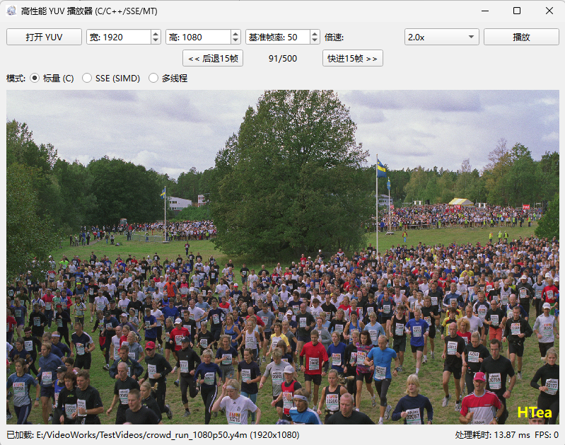

# 高性能 YUV 视频播放器 (High-Performance YUV Player)



一个基于 C/C++ 与 Qt 开发的高性能 YUV 视频播放器，核心算法通过 SSE 指令集与多线程技术深度优化，专为流畅播放高分辨率（如 1080p）无压缩 YUV 视频而设计。

## ✨ 项目亮点 (Key Features)

- **广泛的格式支持**
  - **Raw YUV420P (`.yuv`)**：支持标准无压缩 YUV 格式。
  - **YUV4MPEG2 (`.y4m`)**：**智能解析**文件头，自动识别视频分辨率（如 W1920 H1080），告别繁琐的手动参数输入。

- **极致的性能优化**
  - **标量优化 (Scalar)**：使用整数运算代替浮点运算，优化基础色彩转换效率。
  - **SIMD 加速 (SSE)**：利用 SSE2 指令集 (`_mm_loadu_si128`, `_mm_mullo_epi16`) 进行向量化并行计算，单指令处理 8 个像素。
  - **多线程并行 (Multi-threading)**：基于 Windows 原生线程 API (`_beginthreadex`)，将图像分块并行处理，充分释放多核 CPU 潜力。

- **完善的播放控制**
  - **倍速播放**：支持 0.5x, 1.0x, 1.5x, 2.0x, 4.0x 多档变速，满足不同浏览需求。
  - **快进/快退**：一键前后跳转 15 帧，快速定位关键画面。
  - **实时状态监控**：底部状态栏实时显示当前帧率 (FPS) 和每帧处理耗时 (ms)。

- **现代化的图形界面**
  - 基于 **Qt 6 (C++)** 构建，界面简洁美观。
  - **个性化定制**：集成了作者 HTea 的专属水印与程序图标。

## 🚀 性能基准测试 (Benchmarks)

我们在 **1080p (1920x1080)** 分辨率下进行了严格的性能测试，对比了三种模式的处理速度。

**测试环境**：
*   **CPU**: 4 核处理器
*   **分辨率**: 1920x1080
*   **编译模式**: Release (O2 优化)

| 模式 (Mode) | 平均每帧耗时 (Time per Frame) | 相对加速比 (Speedup) | 备注 |
| :--- | :---: | :---: | :--- |
| **标量 (Scalar)** | ~6.61 ms | 1.00x | 基础 C 语言实现 (已做整数优化) |
| **SSE 指令集** | ~4.24 ms | 1.56x | 开启 SIMD 向量化优化 |
| **多线程 (MT)** | **~1.44 ms** | **4.60x** | 4 线程 + SSE 并行加速 |

> **结论**：在 1080p 高清视频下，开启多线程优化后性能提升近 **5 倍**，不仅能够轻松跑满 60fps，还为 CPU 留出了大量空闲资源。

## 🛠️ 技术架构 (Technical Architecture)

本项目采用 **C/C++ 混合编程** 架构：
*   **Core (C语言)**：负责底层高性能计算。
    *   `yuv_reader.c`：文件读取与解析。
    *   `yuv_converter.c`：标量色彩转换。
    *   `yuv_converter_sse.c`：SIMD 色彩转换。
    *   `thread_pool.c`：多线程任务分发。
*   **GUI (C++/Qt)**：负责界面展示与交互逻辑。
    *   `mainwindow.cpp`：主窗口逻辑与播放控制。
    *   `videowidget.cpp`：视频渲染与水印绘制。

## 📦 编译与运行 (Build & Run)

### 环境要求
- **编译器**: GCC (MinGW) 或 MSVC (需支持 C++17)
- **构建工具**: CMake 3.20 或更高版本
- **Qt 版本**: Qt 6.x (本项目基于 Qt 6.10.2 开发)

### Windows (MinGW) 构建步骤

1.  **克隆仓库**：
    ```bash
    git clone https://github.com/HUITianYi/YUVPlayer.git
    cd YUVPlayer
    ```

2.  **创建构建目录**：
    ```bash
    mkdir build
    cd build
    ```

3.  **配置并编译 (推荐 Release 模式以获得最佳性能)**：
    ```bash
    cmake .. -G "MinGW Makefiles" -DCMAKE_BUILD_TYPE=Release
    cmake --build .
    ```

4.  **运行程序**：
    为了确保能找到 Qt 的 DLL 文件，推荐使用 `windeployqt` 工具：
    ```bash
    windeployqt YUVPlayer.exe
    ./YUVPlayer.exe
    ```

## 📂 项目结构

```
YUVPlayer/
├── CMakeLists.txt       # CMake 构建脚本
├── README.md            # 项目说明文档 (本文档)
├── REPORT.md            # 详细的实践报告与技术分析
├── screenshot.png       # 程序运行截图
└── src/
    ├── benchmark.cpp    # 独立性能基准测试工具
    ├── main.cpp         # 程序入口
    ├── resources/       # 资源文件 (图标、qrc)
    ├── core/            # 核心算法层 (纯 C 实现)
    │   ├── thread_pool.c       # 多线程调度
    │   ├── yuv_converter_sse.c # SSE 优化实现
    │   └── yuv_reader.c        # YUV/Y4M 文件解析
    └── gui/             # 界面层 (Qt/C++ 实现)
        ├── mainwindow.cpp      # 播放逻辑控制
        └── videowidget.cpp     # 视频渲染控件
```

## 📝 常见问题 (FAQ)

**Q: 为什么播放小分辨率视频 (如 CIF) 时多线程反而变慢？**
A: 这是正常的。创建和销毁线程本身有开销（Context Switch）。对于小图，计算量很小，线程开销占比大，反而拖慢速度；对于大图（1080p+），计算量占主导，多线程优势才能体现。

**Q: 为什么我的画面是横向花屏？**
A: 这通常是因为分辨率设置错误。如果是 `.y4m` 文件，本播放器会自动识别分辨率；如果是 `.yuv` 文件，请确保在界面上手动输入正确的宽和高。

## 📄 许可证 (License)

本项目采用 [MIT License](LICENSE) 许可证。

## 👤 作者 (Author)

**HTea** - [GitHub Profile](https://github.com/HUITianYi)

---
*Developed with ❤️ by HTea for Visual Media Communication Course.*
